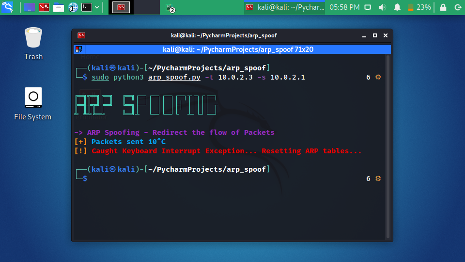

<div align="center">
    
</div>

<h3 align="center"> ARP Spoofing - Redirect the flow of Packets. </h3>

---

## Usage


```shell script
python3 arp_spoof.py -t [Target IP of Victim] -s [Spoof/Gateway/Router IP]
```

- **Target IP of Victim** (eg. Windows or any other machine IP)
- **Spoof/Gateway/Router IP** (eg. Router or any access point IP)

---

## Enable Port Forwarding
Our Kali Linux computer is not the router, so if it get requests, it's actually going to stop them from flowing and going to the router. This is a security feature in Linux.
Enable Port Forwarding so that this computer would allow packets to flow through it just like a router.

```shell script
sudo bash -c 'echo 1 > /proc/sys/net/ipv4/ip_forward'
```

## Modules Used
- [scapy](https://scapy.readthedocs.io/en/latest/introduction.html)
- [argparse](https://docs.python.org/3/library/argparse.html#module-argparse)
- sys
- time


## Contributing:

 - Fork it !
 - Create your feature branch: `git checkout -b my-new-feature`
 - Commit your changes: `git commit -am 'Add some feature'`
 - Push to the branch: `git push origin my-new-feature`
 - Submit a pull request.
