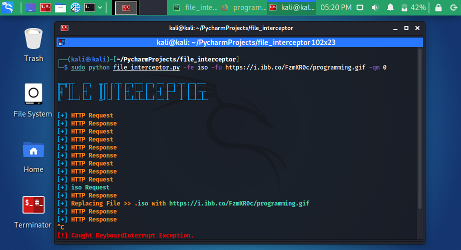
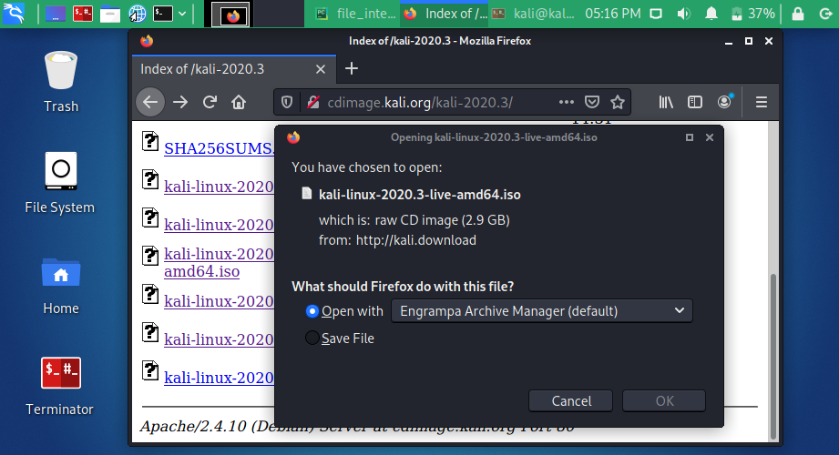

<div align="center">
    
</div>

<h3 align="center"> File Interceptor - Replace Download Requests ! </h3>

---


## Modules Used
- [scapy](https://scapy.readthedocs.io/en/latest/introduction.html)
- [netfilterqueue](https://pypi.org/project/NetfilterQueue/)
- [argparse](https://docs.python.org/3/library/argparse.html#module-argparse)
- sys
- time

## Installing **netfilterqueue**
```
apt-get install build-essential python-dev libnetfilter-queue-dev
pip install NetfilterQueue
```

OR

```
git clone https://github.com/kti/python-netfilterqueue.git
cd python-netfilterqueue
python setup.py install
```


## Before Running the Script
Redirecting Packets to the queue using iptables.
If we're the MiTM, any request that we're going to get or responses will be trapped in a queue.

### For Testing on Local Computer
- Run in terminal
   - sudo iptables -I OUTPUT -j NFQUEUE --queue-num 0
   - sudo iptables -I INPUT -j NFQUEUE --queue-num 0

### For Testing on Remote Computer on Network
- Run in terminal
   - sudo iptables -I FORWARD -j NFQUEUE --queue-num 0


## Usage


```shell script
python file_interceptor.py -fe [file_extension] -fu [fake_file_url] -qm [queue_num]
```

- **File Extension - Extension of the file that you want to intercept.** (eg. exe,pdf,iso,jpg etc)
- **Fake File URL - Fake URL of the file, to intercept the original file.**
- **Queue_Num - Queue Num that, you set with the help of iptables** (eg. 0)


### Example
```shell script
python file_interceptor.py -fe iso -fu https://i.ibb.co/FzmKR0c/programming.gif -qm 0
```

|          Before                           |               After                    |
|-------------------------------------------|----------------------------------------|
|      |      |

## Contributing:

 - Fork it !
 - Create your feature branch: `git checkout -b my-new-feature`
 - Commit your changes: `git commit -am 'Add some feature'`
 - Push to the branch: `git push origin my-new-feature`
 - Submit a pull request.
